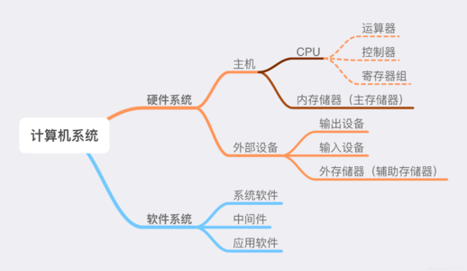
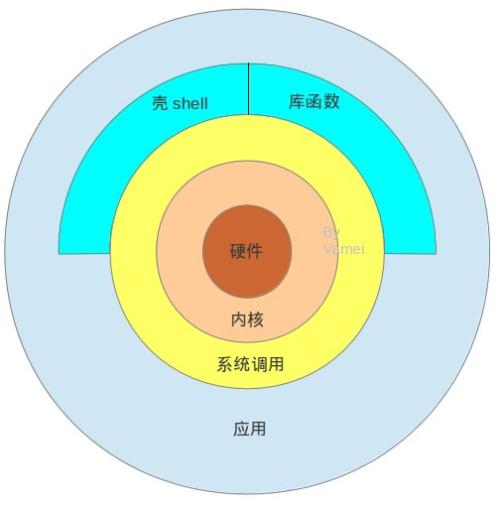
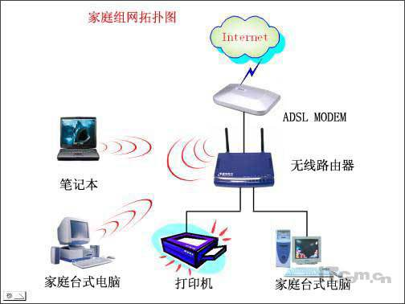
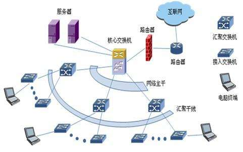
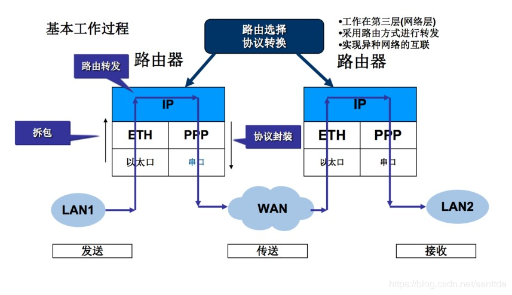

# 从0开始学习编程，需要知道哪些知识
## 计算机组成原理

## 操作系统原理

操作系统主要包括以下几个方面的功能 ：
1. 进程管理，其工作主要是进程调度，在单用户单任务的情况下，处理器仅为一个用户的一个任务所独占， 进程管理的工作十分简单。但在多道程序或多用户的情况 下，组织多个作业或任务时，就要解决处理器的调度、 分配和回收等问题 。
2. 存储管理分为几种功能：存储分配、存储共享、存储保护 、存储扩张。
3. 设备管理分有以下功能：设备分配、设备传输控制 、设备独立性。
4. 文件管理：文件存储空间的管理、目录管理 、文件操作管理、文件保护。
5. 作业管理是负责处理用户提交的任何要求。

## 计算机网络
分类：
1. 局域网：Local Area Network，LAN。   
 
2. 广域网：Wide Area Network，WAN。   
  

### 路由器工作原理
 

