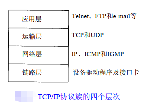
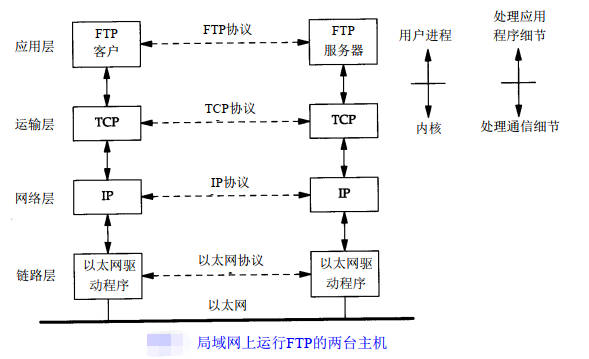
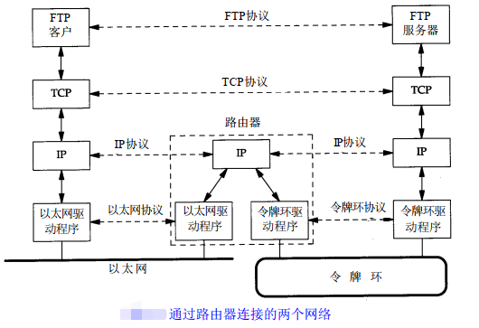
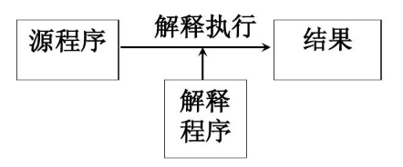
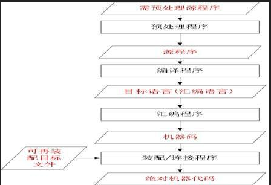
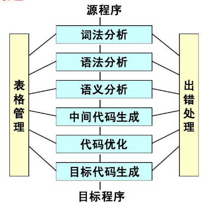
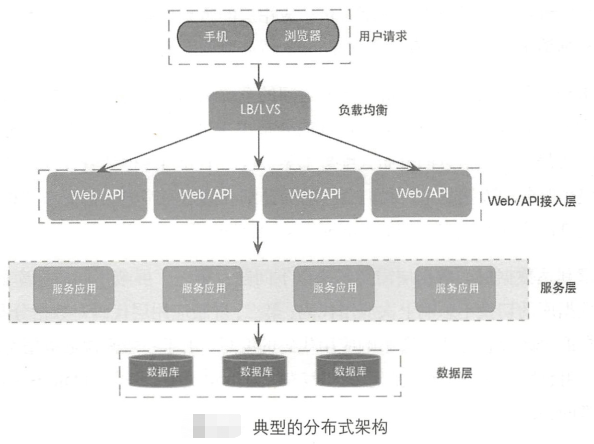
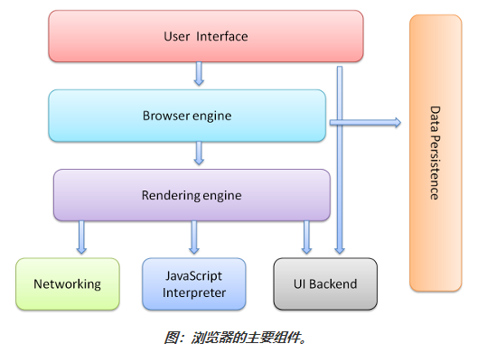
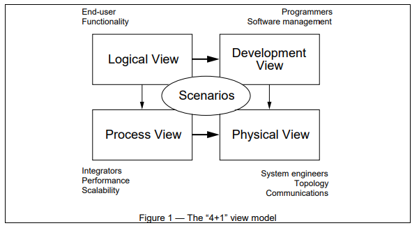

# 从0开始学习计算机编程，需要知道哪些知识
## Contents
* [计算机组成原理](#计算机组成原理)
* [操作系统原理](#操作系统原理)
* [计算机网络](#计算机网络)
* [编程原理](#编程原理)
* [数据结构与算法](#数据结构与算法)
* [面向对象编程](#面向对象编程)
* [数据库](#数据库)
* [软件工程（信息系统项目管理）](#软件工程信息系统项目管理)
* [参考书](#参考书)

## 计算机组成原理

## 操作系统原理

操作系统主要包括以下几个方面的功能 ：
1. 进程管理：其工作主要是进程调度，在单用户单任务的情况下，处理器仅为一个用户的一个任务所独占， 进程管理的工作十分简单。但在多道程序或多用户的情况 下，组织多个作业或任务时，就要解决处理器的调度、 分配和回收等问题 。
2. 存储管理：存储分配、存储共享、存储保护 、存储扩张。
3. 设备管理：设备分配、设备传输控制 、设备独立性。
4. 文件管理：文件存储空间的管理、目录管理 、文件操作管理、文件保护。
5. 作业管理：负责处理用户提交的任何要求。

操作系统实例：
1. 嵌入式系统：
    1. 使用非常广泛的系统（如VxWorks、eCos、Symbian OS及Palm OS）以及某些功能缩减版本的Linux或者其他操作系统。某些情况下，OS指称的是一个内置了固定应用软件的巨大泛用程序。在许多最简单的嵌入式系统中，所谓的OS就是指其上唯一的应用程序。
    2. iOS是由苹果公司开发的手持设备操作系统。最初是设计给 iPhone 使用的，后来陆续套用到 iPod touch 、iPad 以及 Apple TV 等产品上。
    3. Android是一种基于Linux的自由及开放源代码的操作系统。主要使用于移动设备，如智能手机和平板电脑，由Google公司和开放手机联盟领导及开发。尚未有统一中文名称，中国大陆地区较多人使用“安卓”。
2. 类Unix系统：所谓的类Unix家族指的是一族种类繁多的OS，此族包含了System V、BSD与Linux。由于Unix是The Open Group的注册商标，特指遵守此公司定义的行为的操作系统。
3. 微软Windows：Microsoft Windows系列操作系统是在微软给IBM机器设计的MS-DOS的基础上设计的图形操作系统。现在的Windows系统，如Windows 2000、Windows XP皆是创建于现代的Windows NT内核。NT内核是由OS/2和OpenVMS等系统上借用来的。
4. MacOS：是一套运行于苹果Macintosh系列计算机上的操作系统，是一个从NeXTSTEP、Mach以及FreeBSD共同派生出来的微内核BSD系统。

## 计算机网络
分类：
1. 局域网：Local Area Network，LAN。   
 
2. 广域网：Wide Area Network，WAN。   
  

### TCP/IP协议
  
* 应用层协议：如HTTP、FTP、SMTP、TELNET、DNS等  
* 链路层协议：如Ethernet和Wi-Fi  
  
  
* IP地址（IP Address）：
    - IP地址是IP协议提供的一种统一的地址格式，它为互联网上的每一个网络和每一台主机分配一个逻辑地址，以此来屏蔽物理地址的差异。
* 端口号（Port）：
    - 一台拥有IP地址的主机可以提供许多服务，比如Web服务、FTP服务、SMTP服务等，这些服务完全可以通过1个IP地址来实现。因为IP 地址与网络服务的关系是一对多的关系，不能只靠IP地址来区分不同的服务。实际上是通过“IP地址+端口号”来区分不同的服务的。
    - 客户端只需保证该端口号在本机上是惟一的就可以了。客户端端口号因存在时间很短暂又称临时端口号。
    - 一个IP地址的端口通过16bit进行编号，最多可以有65536个端口。端口是通过端口号来标记的，端口号只有整数，范围是从0 到65535。
* 域名（Domain Name）：
    - 是由一串用点分隔的名字组成的Internet上某一台计算机或计算机组的名称，用于在数据传输时标识计算机的电子方位（有时也指地理位置）。
    - 域名系统（DNS，Domain Name System）是因特网的一项核心服务，它作为可以将域名和IP地址相互映射的一个分布式数据库，是进行域名(domain name)和与之相对应的IP地址 (IP address)转换的系统，搭载域名系统的机器称之为域名服务器，能够使人更方便的访问互联网，而不用去记住能够被机器直接读取的IP地址数串。
* 路由器（Router）：
    - 是连接两个或多个网络的硬件设备，在网络间起网关的作用，是读取每一个数据包中的地址然后决定如何传送的专用智能性的网络设备。
    -  

## 编程原理
编辑可以让计算机执行的程序的过程就叫编程。  
计算机使用一种只包含1和0的简单语言，其中1表示“开”，0表示“关”。尝试用计算机自己的语言与其交谈就好像尝试用摩尔斯电报码与朋友交谈一样。  
编程语言相当于您和计算机之间的翻译。您不必学习计算机自己的语言(即“机器语言”)，而是可以使用编程语言，以一种更易于学习和理解的方式向计算机发出指令。一种称为“编译器”的专用程序接受用编程语言编写的指令。并将这些指令转换为机器语言。  

1. 解释程序：把源语言写的程序作为输入，但不产生目标程序，而是边解释边执行源程序本身。  
  
2. 编译程序：也称为编译器（Compiler），是指把用高级程序设计语言书写的源程序，翻译成等价的机器语言格式目标程序的翻译程序。  
  
  

### 网站架构设计
  

### 网页浏览器
网页浏览器（英语：web browser），常被简称为浏览器，是一种用于检索并展示万维网信息资源的应用程序。这些信息资源可为网页、图片、影音或其他内容，它们由统一资源标志符标志。信息资源中的超链接可使用户方便地浏览相关信息。  
网页浏览器虽然主要用于使用万维网，但也可用于获取专用网络中网页服务器之信息或文件系统内之文件。  
主流网页浏览器有Mozilla Firefox、Internet Explorer、Microsoft Edge、Google Chrome、Opera及Safari。  
* 主要组件包括：  
      
    1. 用户界面 － 包括地址栏、后退/前进按钮、书签目录等，也就是所看到的除了用来显示所请求页面的主窗口之外的其他部分。  
    2. 浏览器引擎 － 用来查询及操作渲染引擎的接口。  
    3. 渲染引擎 － 用来显示请求的内容，例如，如果请求内容为html，它负责解析html及css，并将解析后的结果显示出来。  
    4. 网络 － 用来完成网络调用，例如http请求，它具有平台无关的接口，可以在不同平台上工作。  
    5. UI后端 － 用来绘制类似组合选择框及对话框等基本组件，具有不特定于某个平台的通用接口，底层使用操作系统的用户接口。  
    6. JS解释器 － 用来解释执行JS代码。  
    7. 数据存储 － 属于持久层，浏览器需要在硬盘中保存类似cookie的各种数据，HTML5定义了web database技术，这是一种轻量级完整的客户端存储技术。  

## 数据结构与算法
### 常用数据结构
1. 数组(Array)  
数组是一种聚合数据类型，它是将具有相同类型的若干变量有序地组织在一起的集合。数组可以说是最基本的数据结构，在各种编程语言中都有对应。一个数组可以分解为多个数组元素，按照数据元素的类型，数组可以分为整型数组、字符型数组、浮点型数组、指针数组和结构数组等。数组还可以有一维、二维以及多维等表现形式。
2. 栈( Stack)  
栈是一种特殊的线性表，它只能在一个表的一个固定端进行数据结点的插入和删除操作。栈按照后进先出的原则来存储数据，也就是说，先插入的数据将被压入栈底，最后插入的数据在栈顶，读出数据时，从栈顶开始逐个读出。栈在汇编语言程序中，经常用于重要数据的现场保护。栈中没有数据时，称为空栈。
3. 队列(Queue)  
队列和栈类似，也是一种特殊的线性表。和栈不同的是，队列只允许在表的一端进行插入操作，而在另一端进行删除操作。一般来说，进行插入操作的一端称为队尾，进行删除操作的一端称为队头。队列中没有元素时，称为空队列。
4. 链表( Linked List)  
链表是一种数据元素按照链式存储结构进行存储的数据结构，这种存储结构具有在物理上存在非连续的特点。链表由一系列数据结点构成，每个数据结点包括数据域和指针域两部分。其中，指针域保存了数据结构中下一个元素存放的地址。链表结构中数据元素的逻辑顺序是通过链表中的指针链接次序来实现的。
5. 树( Tree)  
树是典型的非线性结构，它是包括n（n>=0）个结点的有穷集。在树结构中，有且仅有一个根结点，该结点没有前驱结点。在树结构中的其他结点都有且仅有一个前驱结点，而且可以有两个后继结点m（m≥0）。
6. 图(Graph)  
图是另一种非线性数据结构。在图结构中，数据结点一般称为顶点，而边是顶点的有序偶对。如果两个顶点之间存在一条边，那么就表示这两个顶点具有相邻关系。 
7. 堆(Heap)  
堆是一种特殊的树形数据结构，一般讨论的堆都是二叉堆。堆的特点是根结点的值是所有结点中最小的或者最大的，并且根结点的两个子树也是一个堆结构。 
8. 散列表(Hash)  
散列表源自于散列函数(Hash function)，其思想是如果在结构中存在关键字和T相等的记录，那么必定在F(T)的存储位置可以找到该记录，这样就可以不用进行比较操作而直接取得所查记录。 

### 算法
#### 算法复杂度

### 常用算法
1. 查找  

| 算法序号  | 算法名称 | 时间复杂度 | 空间复杂度 | 备注 |
| :---------: | :-------- | :-------- | :-------- | :-------- |
| 1 | 顺序查找 Sequential search |  |  |  |
| 2 | 二分查找 Binary search | O(logN) |  | 适用于已经排好序的数据进行查找。 |
| 3 | 块查找 Blocking search |  |  |  |
| 4 | 哈希查找 Hash search | O(1) |  | 关键是Hash函数算法（Hash function）和碰撞的解决办法（Collision resolution）。 |
| 5 | 二叉树查找 Binary search tree search |  |  |  |

2. 排序

| 算法序号  | 算法名称 | 平均时间复杂度 | 最好情况 | 最坏情况 | 空间复杂度 | 排序方式 | 稳定性 | 备注 |
| :---------: | :-------- | :-------- | :-------- | :-------- | :-------- | :-------- | :-------- | :-------- |
| 1 | 冒泡排序 | O(n^2) | O(n) | O(n^2) | O(1) | In-place | 稳定 |  |
| 2 | 选择排序 | O(n^2) | O(n^2) | O(n^2) | O(1) | In-place | 不稳定 |  |
| 3 | 插入排序 | O(n^2) | O(n) | O(n^2) | O(1) | In-place | 稳定 |  |
| 4 | 希尔排序 | O(n log n) | O(n log^2 n) | O(n log^2 n) | O(1) | In-place | 不稳定 |  |
| 5 | 归并排序 | O(n log n) | O(n log n) | O(n log n) | O(n) | Out-place | 稳定 |  |
| 6 | 快速排序 | O(n log n) | O(n log n) | O(n^2) | O(log n) | In-place | 不稳定 |  |
| 7 | 堆排序 | O(n log n) | O(n log n) | O(n log n) | O(1) | In-place | 不稳定 |  |
| 8 | 计数排序 | O(n + k) | O(n + k) | O(n + k) | O(k) | Out-place | 稳定 |  |
| 9 | 桶排序 | O(n + k) | O(n + k) | O(n^2) | O(n + k) | Out-place | 稳定 |  |
| 10 | 基数排序 | O(n * k) | O(n * k) | O(n * k) | O(n + k) | Out-place | 稳定 |  |

## 面向对象编程
* 三大特征：封装、继承、多态
* 六大原则（低耦合，高内聚，针对接口编程）：
    - 1、开闭原则（Open Close Principle）
    - 2、里氏代换原则（Liskov Substitution Principle）
    - 3、依赖倒转原则（Dependence Inversion Principle）
    - 4、接口隔离原则（Interface Segregation Principle）
    - 5、迪米特法则，又称最少知道原则（Demeter Principle）
    - 6、单一职责原则（Single responsibility principle）
* 设计模式(Design Pattern)：
    - 1、创建型模式（5种）：单例模式（Singleton）、抽象工厂模式（Abstract Factory）、建造者模式（Builder）、工厂模式（Factory Method）、原型模式（Prototype）。
    - 2、结构型模式（7种）：适配器模式（Adapter）、桥接模式（Bridge）、装饰模式（Decorator）、组合模式（Composite）、外观模式（Facade）、享元模式（Flyweight）、代理模式（Proxy）。
    - 3、行为型模式（11种）：模版方法模式（Template Method）、命令模式（Command）、迭代器模式（Iterator）、观察者模式（Observer）、中介者模式（Mediator）、备忘录模式（Memento）、解释器模式（Interpreter）、状态模式（State）、策略模式（Strategy）、职责链模式（Chain of Responsibility）、访问者模式（Visitor）。
* [UML](https://www.uml.org/what-is-uml.htm)：
    - Structure Diagrams include the Class Diagram, Object Diagram, Component Diagram, Composite Structure Diagram, Package Diagram, and Deployment Diagram. 
    - Behavior Diagrams include the Use Case Diagram (used by some methodologies during requirements gathering); Activity Diagram, and State Machine Diagram. 
    - Interaction Diagrams, all derived from the more general Behavior Diagram, include the Sequence Diagram, Communication Diagram, Timing Diagram, and Interaction Overview Diagram.
* 软件架构设计
    - 以满足实现用户需求为前提，以开发人员普遍可接受为根本的，而且要符合系统特性和业务发展需要的，从软件设计的角度，能够达到层次清晰、可维护、可重用、可扩展…
    - Philippe Kruchten提出的4+1视图方法[《The 4+1 View Model of Architecture》](https://www.researchgate.net/publication/220018231_The_41_View_Model_of_Architecture)：

    - 五视图法：逻辑架构、开发架构、运行架构、物理架构、数据架构。

## 数据库
* 三大范式
    1. 第一范式（1NF）：数据库表中的字段都是单一属性的，不可再分。
    2. 第二范式（2NF）：数据库表中不存在非关键字段对任一候选关键字段的部分函数依赖。部分函数依赖指的是存在组合关键字中的某些字段决定非关键字段的情况。
    3. 第三范式（3NF）：在第二范式的基础上，数据表中如果不存在非关键字段对任一候选关键字段的传递函数依赖则符合第三范式。所谓传递函数依赖，指的是如 果存在"A → B → C"的决定关系，则C传递函数依赖于A。
* E-R图：实体（entity）、属性（attribute）、关系/联系（relationship）

## 软件工程（信息系统项目管理）
* 软件工程原理（七条基本原理）：
    - （1）用分阶段的生存周期计划进行严格的管理。
    - （2）坚持进行阶段评审。
    - （3）实行严格的产品控制。
    - （4）采用现代程序设计技术。
    - （5）结果应能清楚地审查。
    - （6）开发小组的人员应该少而精。
    - （7）承认不断改进软件工程实践的必要性。
* 软件工程过程：需求分析（功能性需求、非功能性需求与设计约束）、设计（概要设计、详细设计）、编码（开发工具、编码规范：代码、异常、日志、文档、数据库使用等）和测试（单元测试、集成测试、功能测试、压力测试、系统测试）。
* 软件工程方法：瀑布式开发、迭代式开发、敏捷开发（极限编程：沟通（Communication）、简单（Simplicity）、反馈（Feedback）、勇气（Courage）、尊重（Respect））
* 辅助软件的使用：git（BitBucket/Gitlab）、wiki（Confluence）、jira、jekins、fisheyes。

  
## 参考书
1. 《TCP/IP协议详解》，卷1和卷2。
2. 《C程序设计语言第二版·新版》 ，作者(美)克尼汉（Brian W. Kernighan） 、(美)里奇（Dennis M. Ritchie），翻译徐宝文、 李志，2004年01月机械工业出版社出版。本书全面、系统地讲述了C语言的各个特性及程序设计的基本方法,包括基本概念、类型和表达式、控制流、函数与程序结构、指针与数组、结构、输入与输出、UNIX系统接口、标准库等内容。
3. 《操作系统：精髓与设计原理》不仅全面地讲述了操作系统的基本概念、原理和方法，还清楚地展现了当代操作系统的本质和特点。全书分为八个部分，由浅入深地介绍了计算机系统、操作系统、进程描述和控制、线程、微内核、并发性、内存管理、虚拟内存、单处理器调度、多处理器和实时调度、I/O管理和磁盘调度、文件管理、嵌入式操作系统、计算机安全技术以及分布式操作系统等内容。
3. 《自己动手写操作系统》由电子工业出版社于2005年8月发行，作者是 于渊。本书主要介绍如何用C语言和汇编语言编写出具备操作系统基本功能的操作系统框架。
4. 《OrangeS：一个操作系统的实现》是2009年6月1日电子工业出版社 出版的图书，作者是于渊。本书从只有二十行的引导扇区代码出发，一步一步地向读者呈现一个操作系统框架的完成过程。书中不仅关注代码本身，同时关注完成这些代码的思路和过程。本书不同于其他的理论型书籍，而是提供给读者一个动手实践的路线图。读者可以根据路线图逐步完成各部分的功能，从而避免了一开始就面对整个操作系统数万行代码时的迷茫和挫败感。书中讲解了大量在开发操作系统中需注意的细节问题，这些细节不仅能使读者更深刻地认识操作系统的核心原理，而且使整个开发过程少走弯路。
5. 《30天自制操作系统》是2012年人民邮电出版社出版的图书，作者是川合秀实。这是一本兼具趣味性、实用性与学习性的书籍。作者从计算机的构造、汇编语言、C语言开始解说，让你在实践中掌握算法。在这本书的指导下，从零编写所有代码，30天后就可以制作出一个具有窗口系统的32位多任务操作系统。
6. 《数据结构（C语言版）》，清华大学计算机系列教材，作者严蔚敏、吴伟民，前半部分从抽象数据类型的角度讨论各种基本类型的数据结构及其应用；后半部分主要讨论查找和排序的各种实现方法及其综合分析比较。
7. 《UNIX环境高级编程》书中除了介绍UNIX文件和目录、标准I/O库、系统数据文件和信息、进程环境、进程控制、进程关系、信号、线程、线程控制、守护进程、各种I/O、进程间通信、网络IPC、伪终端等方面的内容，还在此基础上介绍了多个应用示例，包括如何创建数据库函数库以及如何与网络打印机通信等。
8. 《深入理解 Linux 内核》为了彻底理解是什么使得Linux能正常运行以及其为何能在各种不同的系统中运行良好，你需要深入研究内核最本质的部分。内核处理CPU与外界间的所有交互，并且决定哪些程序将以什么顺序共享处理器时间。它如此有效地管理有限的内存，以至成百上千的进程能高效地共享系统。它熟练地统筹数据传输，这样CPU 不用为等待速度相对较慢的硬盘而消耗比正常耗时更长的时间。
7. 《设计模式：可复用面向对象软件的基础》（Design Patterns - Elements of Reusable Object-Oriented Software）一书中介绍了23种设计模式。
8. 《人月神话》Brooks博士为人们管理复杂项目提供了最具洞察力的见解，既有很多发人深省的观点，又有大量软件工程的实践。本书内容来自Brooks博士在IBM公司SYSTEM/360家族和OS/360中的项目管理经验，该项目堪称软件开发项目管理的典范。
9. 《The Pragmatic Programmer —— 程序员修炼之道：从小工到专家》
10. 《Software Architecture in Practice,2nd Edition--软件构架实践(第2版)》
11. 《Documenting Software Architectures --软件构架编档》
12. 《Applied Software Architecture --实用软件体系结构》

